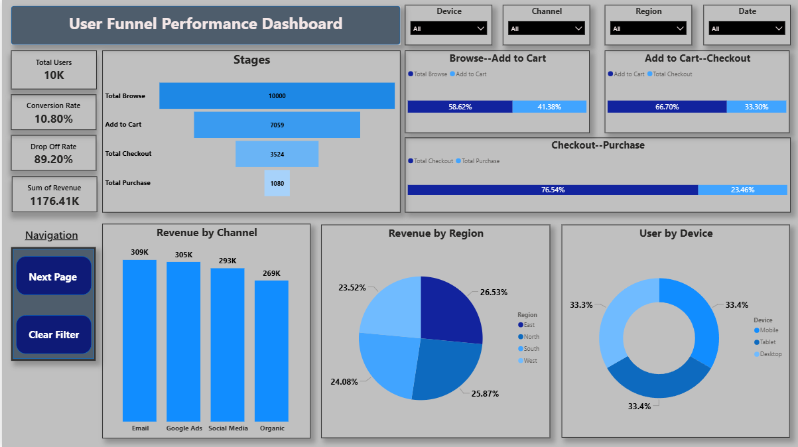
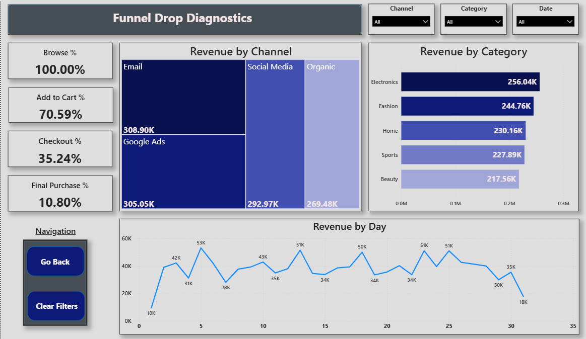

# 📊 Funnel Analysis Project  
[]()  []()  [](https://github.com/Rohitdas-01/funnel-analysis-project-python-powerbi)


---

## 📌 Table of Contents  
- [Overview](#overview)  
- [Business Requirement](#business-requirement)  
- [Dataset](#dataset)  
- [Tools & Technologies](#tools--technologies)  
- [Project Structure](#project-structure)  
- [Exploratory Data Analysis (EDA)](#eda)  
- [EDA Insights](#eda-insights)  
- [Dashboard](#dashboard)  
- [How to Run This Project](#how-to-run-this-project)  
- [Contact](#contact)

---

## <a id="overview"></a>🧾 Overview  
This project performs an in-depth **website funnel analysis** for October 2025 to understand how users move from initial website visits to final purchases.  

Workflow includes:

1. **Python (Jupyter Notebook):**  
   Data cleaning, transformation, EDA, funnel stage mapping, KPI calculations  
2. **Power BI:**  
   Interactive dashboard for funnel metrics, drop-off visualization, traffic channel & region analysis  

The aim is to evaluate funnel performance, identify drop-off stages, measure conversion efficiency, and provide actionable business insights.

---

## <a id="business-requirement"></a>🎯 Business Requirement  
The company needed clarity on how users navigate through the website funnel. Key requirements included:

- Tracking funnel progression across stages  
- Stage-wise conversion and drop-off analysis  
- Channel-level traffic quality assessment  
- Regional and product performance evaluation  
- Revenue contribution by completed sessions  
- Dashboard-based monitoring of KPIs and behavior trends  

---

## <a id="dataset"></a>📂 Dataset  

- **Total Rows:** **21,663**  
- **Total Columns:** **10**  
- **Missing Values:** None  
- **Key Columns:**  
  - User_ID, Session_ID  
  - Event, Timestamp  
  - Device, Region  
  - Channel  
  - Product_Category  
  - Revenue, Bounce_Flag  

---

## <a id="tools--technologies"></a>🛠 Tools & Technologies  

| Tool | Usage |
|------|--------|
| 🐍 **Python** | Data cleaning, funnel mapping, EDA & metrics calculation |
| 📊 **Power BI** | Dashboard & KPI visualization |
| 📓 **Jupyter Notebook** | EDA workflow |
| 🗂 **GitHub** | Version control |

---

## <a id="project-structure"></a>📁 Project Structure  
```
funnel-analysis-project-python-powerbi/
│
├── 📂 analysis report
│   ├── funnel_analysis_presentation.pptx
│   └── funnel_analysis_report.pdf
│
├── 📂 dashboard
│   └── funnel_analysis.pbix
│
├── 📂 dataset
│   └── funnel_analysis_data.csv
│
├── 📂 images
│   ├── dashboard_page1.png
│   └── dashboard_page2.png
│
├── 📂 notebooks
│   └── exploratory_data_analysis.ipynb
│
├── 📄 Problem Statement.pdf
│
└── 📄 README.md

```


---

## <a id="eda"></a>📊 Exploratory Data Analysis (EDA)

### Conducted in Python (Jupyter Notebook):

- Imported libraries (Pandas, Numpy, Seaborn, Matplotlib, Plotly)  
- Loaded the dataset and validated structure  
- No missing or duplicate values detected  
- Generated date/time-based features  
- Created **event sequences per session**  
- Mapped funnel stages:  
  **Browse → Add to Cart → Checkout → Purchase**  
- Converted event-level data to session-level  
- Calculated session duration, bounce flag, and final funnel stage reached  
- Computed conversion rates & drop-off percentages  
- Analyzed revenue, engagement patterns, and KPIs  
- Created funnel charts, drop-off visualizations & performance metrics  

---

## <a id="eda-insights"></a>🧠 EDA Insights (Key Findings)

### 🔹 Funnel Performance
- Total sessions analyzed: **21,663**
- Highest drop-off at **Checkout → Purchase**
- Significant drop between **Add to Cart → Checkout**
- Bounce sessions indicate early exits with low engagement

### 🔹 Traffic Channel Insights
- Certain channels contribute high traffic but poor funnel movement  
- Channels with high bounce rates negatively influence conversions  
- A few channels deliver strong, high-intent users  

### 🔹 Regional Performance
- Some regions show **stronger conversion efficiency**  
- Others drive high sessions but **low revenue contribution**

### 🔹 Product Category Behavior
- Few categories reflect **high engagement** and **better purchase likelihood**  
- Some categories attract views but fail to convert

### 🔹 Revenue Insights
- Strong revenue generated at final funnel stage  
- **Average order value stable** across product categories  
- Revenue per session increases significantly at deeper stages

### 🔹 Engagement Metrics
- Longer session duration correlates with higher funnel advancement  
- Short sessions heavily contribute to the bounce rate  

---

## <a id="dashboard"></a>📈 Dashboard (Power BI)

The dashboard includes:

- Overall funnel KPIs  
- Stage-wise conversions & drop-off  
- Traffic channel performance  
- Region-level conversion & engagement  
- Product category contribution  
- Revenue & session behavior analytics  

### Dashboard Page - 1 


### Dashboard Page - 2




---

## <a id="how-to-run-this-project"></a>▶️ How to Run This Project  

### Step 1 — Clone the Repository**
```bash
git clone https://github.com/Rohitdas-01/funnel-analysis-project-python-powerbi.git
```
### Step 2 - Run Exploratory Data Analysis (Python)

Open Jupyter Notebook
Navigate to notebooks/
Run:
```bash
exploratory_data_analysis.ipynb
```
This includes:
- Data loading
- Data cleaning
- Funnel stage mapping
- KPI generation
- Visualizations

### Step 4 - Open Power BI Dashboard
```bash
dashboard/funnel_analysis.pbix
```
### Step 5 - Review Outputs
- Funnel analysis report 
- Power BI Dashboard
- Python EDA notebook insights

---

## <a id="contact"></a>📞 Contact

**Rohit Das**

** Email:**  
rohit.41.das@gmail.com  

** LinkedIn:**  
https://www.linkedin.com/in/rohit-das-jsr/
